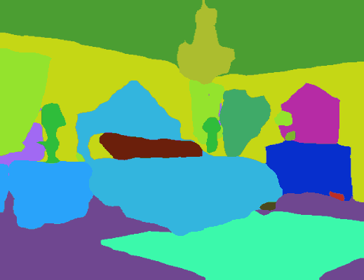

# Basic-image-segmentation-keras-with-kMean-clusters-as-pesented-by-Vidhya
kMean clusters used for final labeling of segments based on the repository of Divamgupta.

https://github.com/divamgupta/image-segmentation-keras

This repository is based on studying Divamgupta's GitHub repository, blog and other written materials that we have found online. This is great work and a real help to a novice such as myself. We will be creating a few repositories using my interpretation of how this all might be implemented. I might be wrong, so any constructive criticism is welcome. We are still using Divamgupta's pre-trained example shown in his Readme file. 

The following is the original photo that we are working from:

We use the pre-trained code to create our segmentation using load_pretrain_and_create_image.py driven from an xterm. We then use interactive_plots_clusters_with_box.py to discriminate the various predicted clusters and isolate on the one item that we are interested in. 

With this program we can interactively select the pixel value associated with a particular cluster or segment in the photograph that we are trying to isolate. The python program is interactive_plots_clusters_with_box.py 

We made our initial segmentation working with the the bedroom picture under the sample_images subdirectory (1_input.jpg). After discriminating all of the major features in the photo as shown above, we then isolate a particular item in the picture (bed), and create a subsequent image showing just that feature with a green rectangle around it. 

We are working in Ubuntu and each python program is driven from an xterm command line using 'python xxxx.py' as the command. 

This second repository is similar to another Keras application repository found here except we are be using the kMean clusters for image segmentation as presented by Vidhya for our final image segmentation. This kMean method reduces some noise in the isolation of features as what is shown below using just pixel value thresholds for segmentation:

